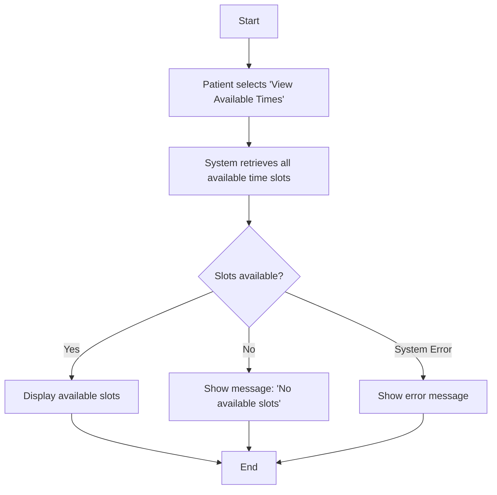
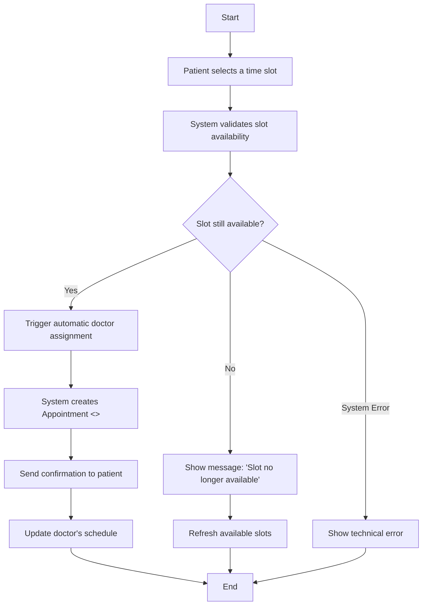

### 1. Activity Diagram 1: Request Appointment

```mermaid
flowchart TD
        A(["Start"])
        A --> B["Patient selects 'Request Appointmen'"]
        B --> C[System informs doctor will be assigned automatically]
        C --> D[System creates Appointment Request]
        D --> E{Are there available time slots?}
            E -->|Yes| F[Show available appointment times]
            F --> G[End]
        
            E -->|No| H["Show message:''No slots availabl'"]
            H --> I[Offer notifications for future slots]
            I --> G[End]
        E -->|System Error| J[Show error message]
        J --> G[End]


```

### 2. Sequence Diagram – View Available Times

```mermaid
flowchart TD
A[Start] --> B["Patient selects 'View Available Times'"]
B --> C[System retrieves all available time slots]
C --> D{Slots available?}
D -->|Yes| E[Display available slots]
E --> F[End]

D -->|No| G[Show message: 'No available slots']
G --> F

D -->|System Error| H[Show error message]
H --> F

```

### 3. Reserve Appointment Slot

```mermaid

flowchart TD
A[Start] --> B[Patient selects a time slot]
B --> C[System validates slot availability]
C --> D{Slot still available?}

D -->|Yes| E[Trigger automatic doctor assignment]
E --> F[System creates Appointment <<Confirmed>>]
F --> G[Send confirmation to patient]
G --> H[Update doctor's schedule]
H --> I[End]

D -->|No| J[Show message: 'Slot no longer available']
J --> K[Refresh available slots]
K --> I

D -->|System Error| L[Show technical error]
L --> I


```
