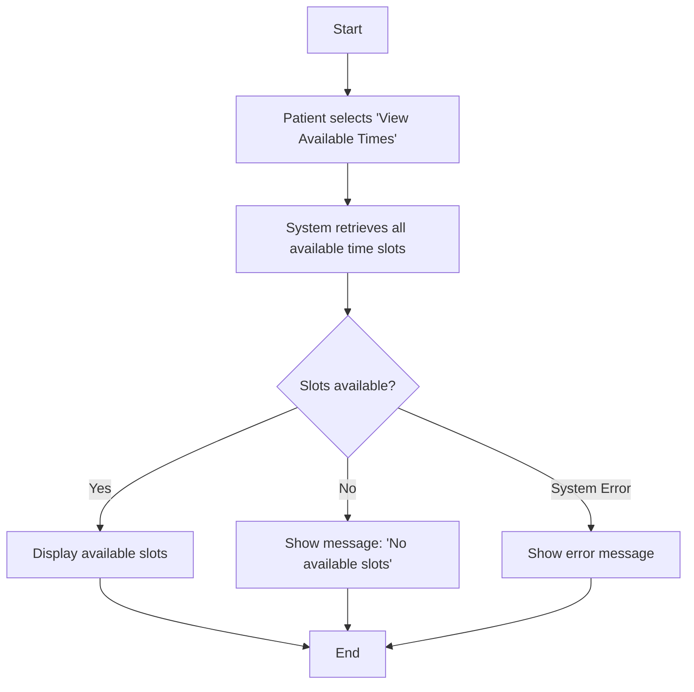
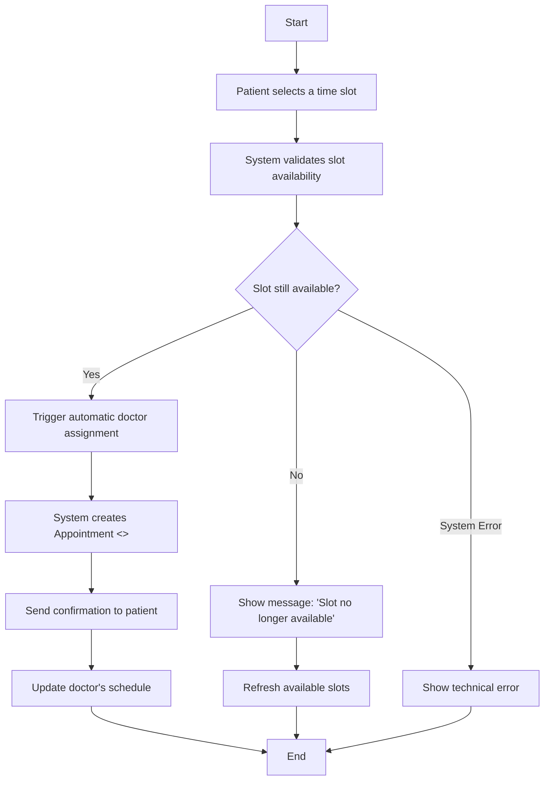
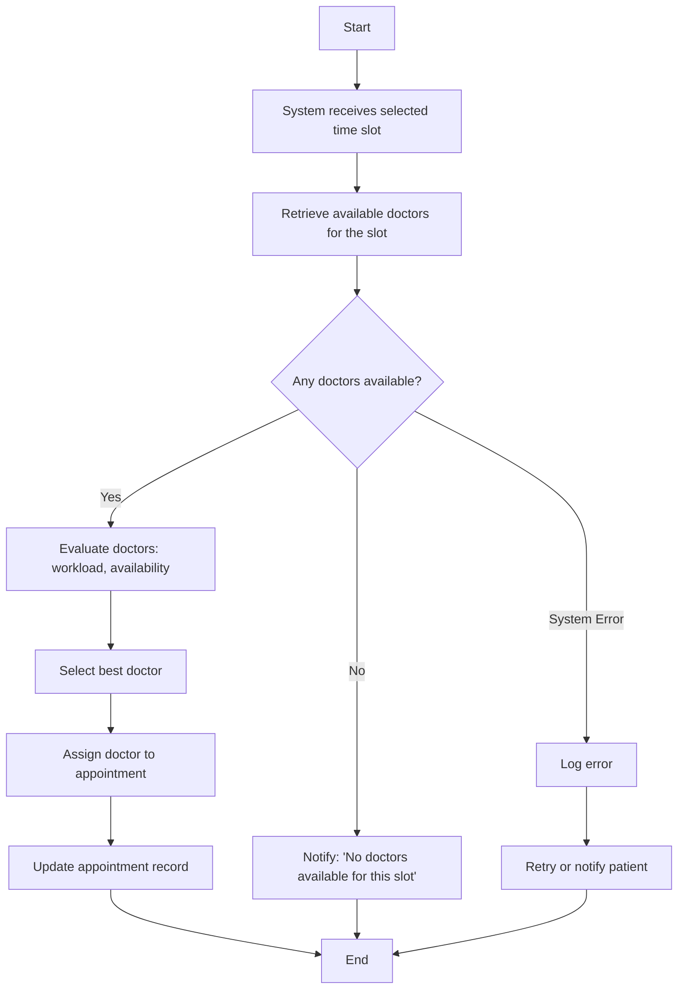
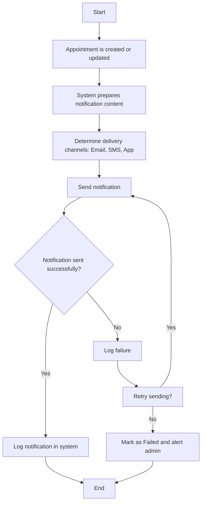
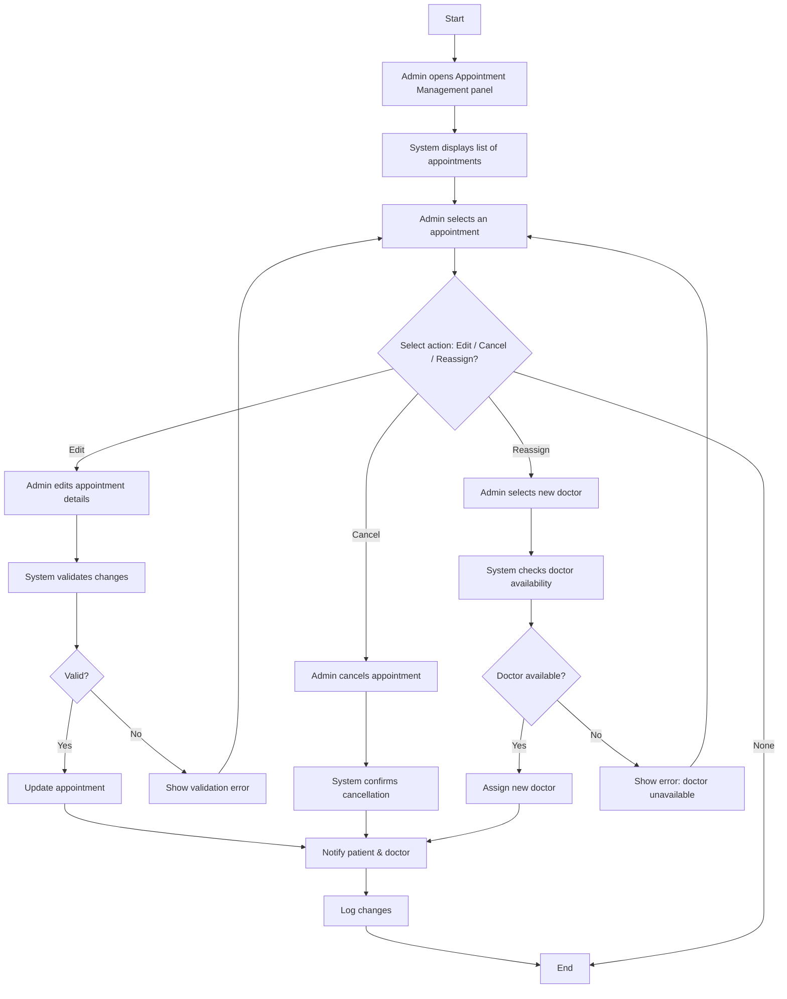

### 1. Activity Diagram 1: Request Appointment

### 2. Sequence Diagram – View Available Times

### 3. Reserve Appointment Slot

### 4. Automatically Assign Doctor

### 5. Send Appointment Notifications

### 6. Admin Manage Appointments

