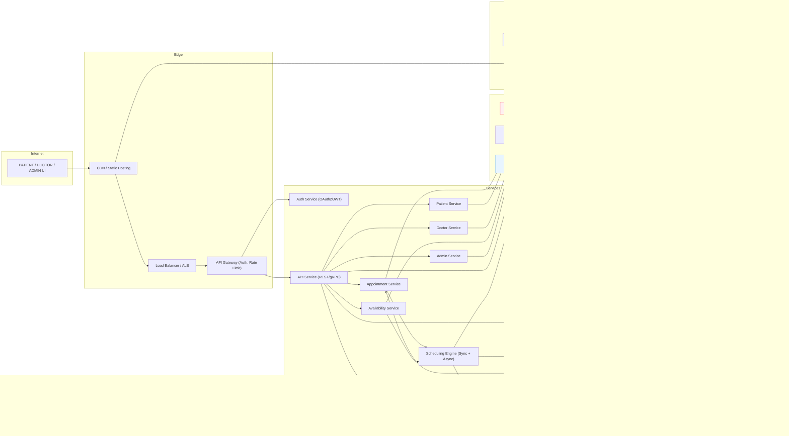

### Architecture diagram

```mermaid

flowchart LR
  subgraph Internet
    User[PATIENT / DOCTOR / ADMIN UI]
  end

  subgraph Edge
    CDN["CDN / Static Hosting"]
    LB["Load Balancer / ALB"]
    APIGW["API Gateway (Auth, Rate Limit)"]
  end

  subgraph Services
    AuthSvc["Auth Service (OAuth2/JWT)"]
    APISvc["API Service (REST/gRPC)"]
    PatientSvc["Patient Service"]
    DoctorSvc["Doctor Service"]
    AppointmentSvc["Appointment Service"]
    AvailabilitySvc["Availability Service"]
    SchedulingEngine["Scheduling Engine (Sync + Async)"]
    NotificationSvc["Notification Service"]
    AdminSvc["Admin Service"]
    WorkerPool["Background Workers"]
    FTManager["Fault Tolerance Manager / Orchestrator"]
  end

  subgraph DataPlane
    Cache["Redis / In-Memory Cache"]
    DB["Primary DB (Postgres)"]
    SearchDB["Search Index (Elasticsearch)"]
    MessageBus["Message Broker (Kafka / RabbitMQ)"]
    Blob["Blob Storage (S3)"]
    Metrics["Metrics / Tracing (Prometheus / Jaeger)"]
    AuditDB["Audit & Logs (Append-only store)"]
  end

  subgraph Infra
    K8s["Kubernetes Cluster"]
    AutoScaler["HPA / Cluster Autoscaler"]
    Backup["DB Backups / PITR"]
    LBInfra["Cloud Load Balancer"]
    CDNInfra["CDN Provider"]
  end

  User --> CDN
  CDN --> LB
  LB --> APIGW
  APIGW --> AuthSvc
  APIGW --> APISvc

  APISvc --> PatientSvc
  APISvc --> DoctorSvc
  APISvc --> AppointmentSvc
  APISvc --> AvailabilitySvc
  APISvc --> AdminSvc

  AppointmentSvc --> SchedulingEngine
  AvailabilitySvc --> SchedulingEngine

  SchedulingEngine --> MessageBus
  MessageBus --> WorkerPool
  WorkerPool --> NotificationSvc
  WorkerPool --> AppointmentSvc
  WorkerPool --> FTManager

  NotificationSvc --> MessageBus

  AppointmentSvc --> DB
  PatientSvc --> DB
  DoctorSvc --> DB
  AvailabilitySvc --> DB
  AdminSvc --> DB

  APISvc --> Cache
  SchedulingEngine --> Cache
  NotificationSvc --> Cache

  APISvc --> SearchDB
  WorkerPool --> Blob

  APISvc --> Metrics
  WorkerPool --> Metrics
  NotificationSvc --> Metrics
  SchedulingEngine --> Metrics

  DB --> Backup
  K8s --> AutoScaler
  K8s --> LBInfra
  CDN --> CDNInfra

  %% notes
  style FTManager fill:#fff3cd,stroke:#d6a700
  style MessageBus fill:#e8f5ff,stroke:#4aa3ff
  style DB fill:#fff0f0,stroke:#ff6b6b

```
