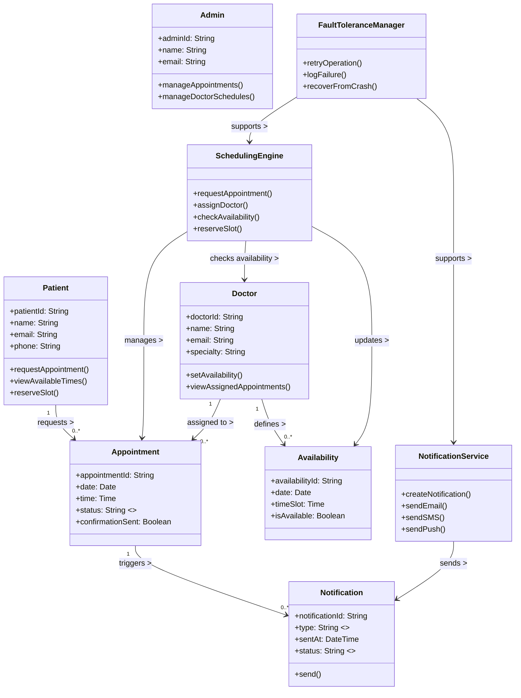

```mermaid

classDiagram
    %% ========================
    %% Main Entities
    %% ========================

    class Patient {
        +patientId: String
        +name: String
        +email: String
        +phone: String
        +requestAppointment()
        +viewAvailableTimes()
        +reserveSlot()
    }

    class Doctor {
        +doctorId: String
        +name: String
        +email: String
        +specialty: String
        +setAvailability()
        +viewAssignedAppointments()
    }

    class Admin {
        +adminId: String
        +name: String
        +email: String
        +manageAppointments()
        +manageDoctorSchedules()
    }

    %% ========================
    %% Appointment & Schedules
    %% ========================

    class Appointment {
        +appointmentId: String
        +date: Date
        +time: Time
        +status: String  <<Pending, Confirmed, Cancelled>>
        +confirmationSent: Boolean
    }

    class Availability {
        +availabilityId: String
        +date: Date
        +timeSlot: Time
        +isAvailable: Boolean
    }

    class Notification {
        +notificationId: String
        +type: String <<Email, SMS, Push>>
        +sentAt: DateTime
        +status: String <<Sent, Failed>>
        +send()
    }

    %% ========================
    %% System Components
    %% ========================

    class SchedulingEngine {
        +requestAppointment()
        +assignDoctor()
        +checkAvailability()
        +reserveSlot()
    }

    class NotificationService {
        +createNotification()
        +sendEmail()
        +sendSMS()
        +sendPush()
    }

    class FaultToleranceManager {
        +retryOperation()
        +logFailure()
        +recoverFromCrash()
    }

    %% ========================
    %% Relationships
    %% ========================

    Patient "1" --> "0..*" Appointment : requests >
    Doctor "1" --> "0..*" Appointment : assigned to >
    Doctor "1" --> "0..*" Availability : defines >
    Appointment "1" --> "0..*" Notification : triggers >

    SchedulingEngine --> Appointment : manages >
    SchedulingEngine --> Doctor : checks availability >
    SchedulingEngine --> Availability : updates >

    NotificationService --> Notification : sends >
    FaultToleranceManager --> SchedulingEngine : supports >
    FaultToleranceManager --> NotificationService : supports >

```

