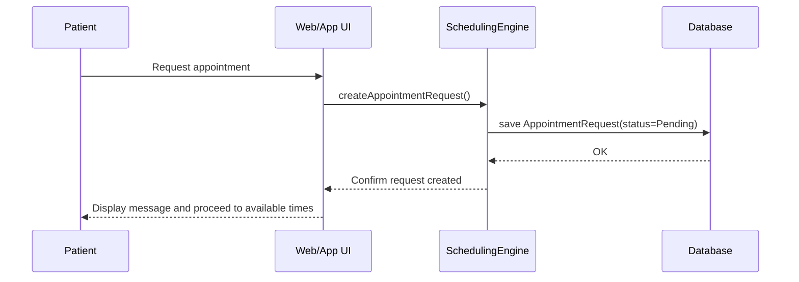
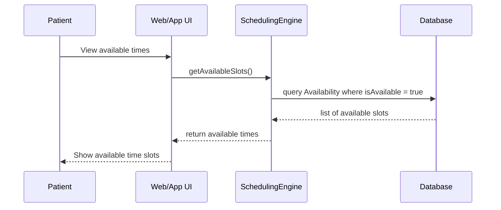
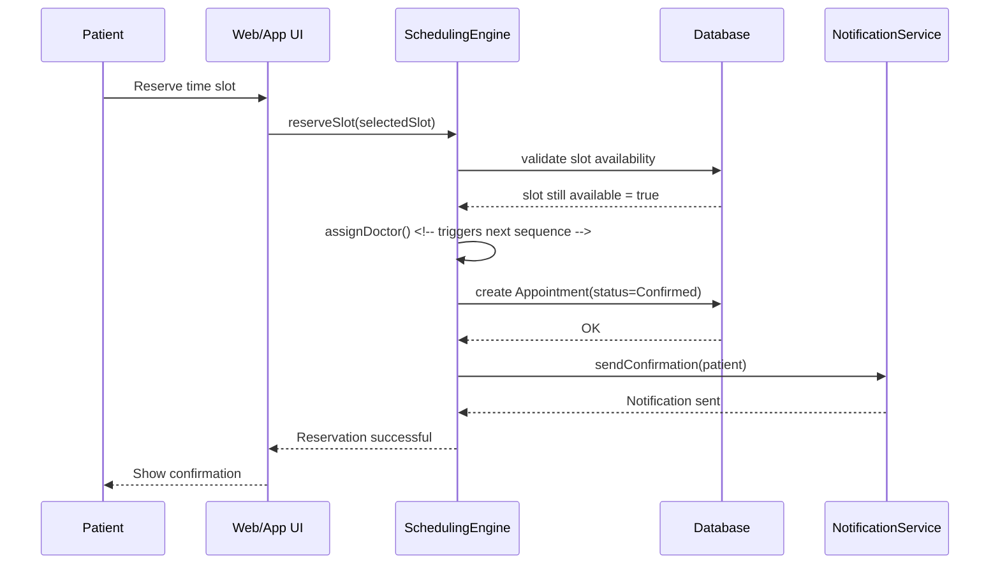
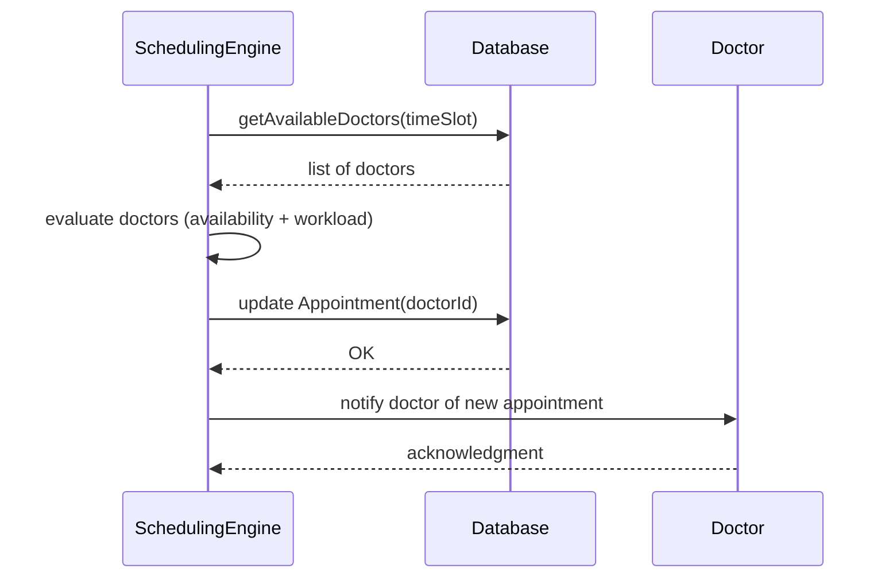
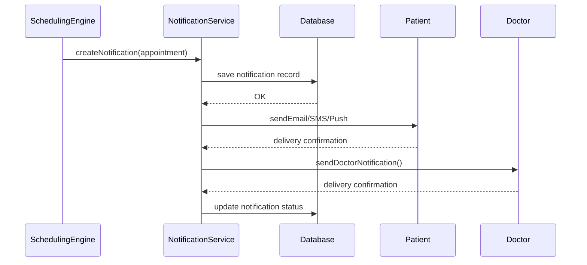
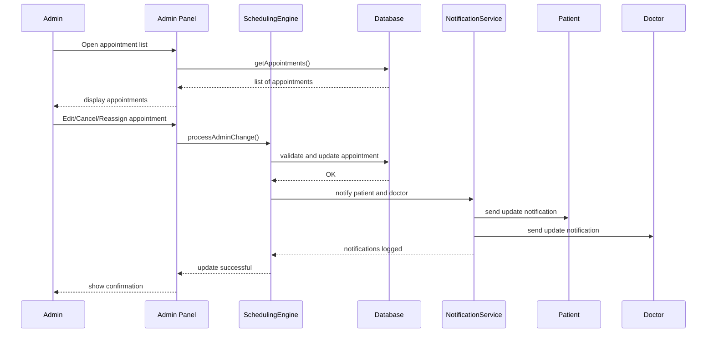

### 1. Sequence Diagram – Request Appointment

### 2. Sequence Diagram – View Available Times

### 3. Sequence Diagram – Reserve Appointment Slot

### 4. Sequence Diagram – Automatically Assign Doctor

### 5. Sequence Diagram – Send Appointment Notifications

### 6. Sequence Diagram – Admin Manage Appointments

